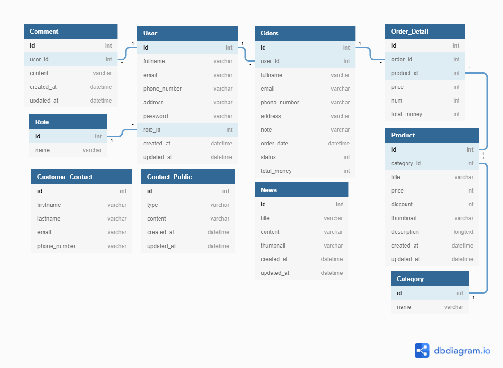

# API

- Authentication:
  - login
  - logout
  - register
  - userList
  - deleteUser
  - editUser
- Product:
  - productlist
  - addProduct
  - deleteProduct
  - editProduct
- Category:
  - categoryList
  - addCategory
  - deleteCategory
  - editCategory
- Order:
  - orderList
  - addOrder
  - deleteOrder
  - editOrder
- Order_Detail:
  - orderDetailList
  - addOrderDetail
  - deleteOrderDetail
  - editOrderDetail
- Customer_Contact:
  - customerContactList
  - addCustomerContact
  - deleteCustomerContact
- Contact_Public:
  - contactPublicList
  - addContactPublic
  - deleteContactPublic
  - editContactPublic
- News:
  - newsList
  - addNews
  - deleteNews
  - editNews
- Comment_Feedback:
  - commentList
  - addComment
  - deleteComment
  - editComment

# Các bảng cần có

## Role table

```sql
CREATE TABLE `Role` (
    `id` int PRIMARY KEY,
    `name` varchar(255)
);
```

## User table

```sql
CREATE TABLE `User` (
  `id` int PRIMARY KEY,
  `fullname` varchar(255),
  `email` varchar(255),
  `phone_number` varchar(255),
  `address` varchar(255),
  `password` varchar(255),
  `role_id` int,
  `created_at` datetime,
  `updated_at` datetime
);
```

## Category table

```sql
CREATE TABLE `Category` (
  `id` int PRIMARY KEY,
  `name` varchar(255)
);
```

## Product table

```sql
CREATE TABLE `Product` (
  `id` int PRIMARY KEY,
  `category_id` int,
  `title` varchar(255),
  `price` int,
  `thumbnail` varchar(255),
  `description` longtext,
  `created_at` datetime,
  `updated_at` datetime
);
```

## Customer_Contact table

```sql
CREATE TABLE `Customer_Contact` (
  `id` int PRIMARY KEY,
  `firstname` varchar(255),
  `lastname` varchar(255),
  `email` varchar(255),
  `phone_number` varchar(255)
);
```

## Order table

```sql
CREATE TABLE `Oders` (
  `id` int PRIMARY KEY,
  `user_id` int,
  `fullname` varchar(255),
  `email` varchar(255),
  `phone_number` varchar(255),
  `address` varchar(255),
  `note` varchar(255),
  `order_date` datetime,
  `status` int,
  `total_money` int
);
```

## Order_Detail table

```sql
CREATE TABLE `Order_Detail` (
  `id` int PRIMARY KEY,
  `order_id` int,
  `product_id` int,
  `price` int,
  `num` int,
  `total_money` int
);
```

## Comment table

```sql
CREATE TABLE `Comment` (
  `id` int PRIMARY KEY,
  `user_id` int,
  `content` varchar(255),
  `created_at` datetime,
  `updated_at` datetime
);
```

## Contact_Public table

```sql
CREATE TABLE `Contact_Public` (
  `id` int PRIMARY KEY,
  `type` varchar(255),
  `content` varchar(255),
  `created_at` datetime,
  `updated_at` datetime
);
```

## News table

```sql
CREATE TABLE `News` (
  `id` int PRIMARY KEY,
  `title` varchar(255),
  `content` varchar(255),
  `thumbnail` varchar(255),
  `created_at` datetime,
  `updated_at` datetime
);
```

## Các liên kết khóa ngoại

```sql
ALTER TABLE `User` ADD FOREIGN KEY (`role_id`) REFERENCES `Role` (`id`);

ALTER TABLE `Product` ADD FOREIGN KEY (`category_id`) REFERENCES `Category` (`id`);

ALTER TABLE `Order_Detail` ADD FOREIGN KEY (`product_id`) REFERENCES `Product` (`id`);

ALTER TABLE `Order_Detail` ADD FOREIGN KEY (`order_id`) REFERENCES `Oders` (`id`);

ALTER TABLE `Oders` ADD FOREIGN KEY (`user_id`) REFERENCES `User` (`id`);

ALTER TABLE `Comment` ADD FOREIGN KEY (`user_id`) REFERENCES `User` (`id`);
```



# Phân tích API

## Authentication

### login

```
- Url: api/authentication.php
- Method: POST
- Request: {
    "action"    : "login",
    "email"     : "nhutan2001@gmail.com",
    "password"  : "123456789"
}
- Response: {
    "status"    : 1 (1: success, 0: failed),
    "message"   : "Login successful!!!"
}
```

### logout

```
- Url: api/authentication.php
- Method: POST
- Request: {
    "action"    : "logout"
}
- Response: {
    "status"    : 1 (1: success, 0: failed),
    "message"   : "Logout successful!!!"
}
```

### register

```
- Url: api/authentication.php
- Method: POST
- Request: {
    "action"    : "register",
    "fullname:  : "Dinh Nhu Tan",
    "phone"     : "0123456789",
    "address"   : "Viet Nam",
    "email"     : "nhutan2001@gmail.com",
    "password"  : "123456789"
}
- Response: {
    "status"    : 1 (1: success, 0: failed),
    "message"   : "Register successful!!!"
}
```

### userList

```
- Url: api/authentication.php
- Method: POST
- Request: {
    "action"    : "list"
}
- Response: {
    "status"    : 1 (1: success, 0: failed),
    "message"   : "Get user list successful!!!",
    "userList"  : [
        {
            "id"        : "0",
            "fullname:  : "Dinh Nhu Tan",
            "phone"     : "0123456789",
            "address"   : "Viet Nam",
            "email"     : "nhutan2001@gmail.com",
        },
        {
            "id"        : "1",
            "fullname:  : "Dinh Nhu Tan",
            "phone"     : "0123456789",
            "address"   : "Viet Nam",
            "email"     : "nhutan2001@gmail.com",
        }
    ]
}
```

### deleteUser

```
- Url: api/authentication.php
- Method: POST
- Request: {
    "action"    : "delete",
    "id"        : "1"
}
- Response: {
    "status"    : 1 (1: success, 0: failed),
    "message"   : "Delete user successful!!!"
}
```

### editUser

```
- Url: api/authentication.php
- Method: POST
- Request: {
    "action"    : "edit",
    "id"        : "1",
    "fullname:  : "Dinh Nhu Tan",
    "phone"     : "0123456789",
    "address"   : "Viet Nam",
    "email"     : "nhutan2001@gmail.com",
    "password"  : "123456789"
}
- Response: {
    "status"    : 1 (1: success, 0: failed),
    "message"   : "Edit user successful!!!"
}
```

## Product

### productList

```
- Url: api/product.php
- Method: POST
- Request: {
    "action"        : "list"
}
- Response: {
    "status"        : 1 (1: success, 0: failed),
    "message"       : "Get product list successful!!!",
    "productList"   : [
        {
            "id"            : "0",
            "title"         : "May tinh",
            "price"         : "12.000.000",
            "thumbnail"     : "http://...",
            "description"   : "Lorem ..."
        },
        {
            "id"            : "1",
            "title"         : "May tinh",
            "price"         : "12.000.000",
            "thumbnail"     : "http://...",
            "description"   : "Lorem ..."
        },
    ]
}
```

### addProduct

```
- Url: api/product.php
- Method: POST
- Request: {
    "action"        : "add",
    "category"       : "1",
    "title"         : "May tinh",
    "price"         : "12.000.000",
    "thumbnail"     : "http://...",
    "description"   : "Lorem ..."
}
- Response: {
    "status"        : 1 (1: success, 0: failed),
    "message"       : "Add product successful!!!",
}
```

### deleteProduct

```
- Url: api/product.php
- Method: POST
- Request: {
    "action"        : "delete",
    "id"            : "1"
}
- Response: {
    "status"        : 1 (1: success, 0: failed),
    "message"       : "Delete product successful!!!",
}
```

### editProduct

```
- Url: api/product.php
- Method: POST
- Request: {
    "action"        : "edit",
    "id"            : "1",
    "category"       : "1",
    "title"         : "May tinh",
    "price"         : "12.000.000",
    "thumbnail"     : "http://...",
    "description"   : "Lorem ..."

}
- Response: {
    "status"        : 1 (1: success, 0: failed),
    "message"       : "Edit product successful!!!",
}
```

## Category

### categoryList

```
- Url: api/category.php
- Method: POST
- Request: {
    "action"        : "list"
}
- Response: {
    "status"        : 1 (1: success, 0: failed),
    "message"       : "Get category list successful!!!",
    "categoryList"  : [
        {
            "id"    : "0",
            "name"  : "Lorem..."
        },
        {
            "id"    : "1",
            "name"  : "Lorem..."
        }
    ]
}
```

### addCategory

```
- Url: api/category.php
- Method: POST
- Request: {
    "action"        : "add",
    "name"          : "Lorem..."
}
- Response: {
    "status"        : 1 (1: success, 0: failed),
    "message"       : "Add category successful!!!"
}
```

### deleteCategory

```
- Url: api/category.php
- Method: POST
- Request: {
    "action"        : "delete",
    "id"            : "0"
}
- Response: {
    "status"        : 1 (1: success, 0: failed),
    "message"       : "Delete category successful!!!"
}
```

### editCategory

```
- Url: api/category.php
- Method: POST
- Request: {
    "action"        : "edit",
    "id"            : "0",
    "name"          : "Lorem..."
}
- Response: {
    "status"        : 1 (1: success, 0: failed),
    "message"       : "Edit category successful!!!"
}
```

## Order

### orderList

```
- Url: api/order.php
- Method: POST
- Request: {
    "action"        : "list"
}
- Response: {
    "status"        : 1 (1: success, 0: failed),
    "message"       : "Get order list successful!!!",
    "orderList"  : [
        {
            "id"        : "0",
            "user_id"   : "0",
            "fullname"  : "Dinh Nhu Tan",
            "email"     : "nhutan2001@gmail.com",
            "phone"     : "0123456789",
            "address"   : "note",
            "order_date": "17/10/2001",
            "status"    : 1 (1: pending, ...),
            "total_money: "12.000.000"
        },
        {
            "id"        : ",
            "user_id"   : "0",
            "fullname"  : "Dinh Nhu Tan",
            "email"     : "nhutan2001@gmail.com",
            "phone"     : "0123456789",
            "address"   : "note",
            "order_date": "17/10/2001",
            "status"    : 1 (1: pending, ...),
            "total_money: "12.000.000"
        },
    ]
}
```

### addOrder

```
- Url: api/order.php
- Method: POST
- Request: {
    "action"        : "add",
    "user_id"   : "0",
    "fullname"  : "Dinh Nhu Tan",
    "email"     : "nhutan2001@gmail.com",
    "phone"     : "0123456789",
    "address"   : "note",
    "order_date": "17/10/2001",
    "status"    : 1 (1: pending, ...),
    "total_money: "12.000.000"
}
- Response: {
    "status"        : 1 (1: success, 0: failed),
    "message"       : "Add order successful!!!"
}
```

### deleteOrder

```
- Url: api/order.php
- Method: POST
- Request: {
    "action"        : "delete",
    "id"   : "0"
}
- Response: {
    "status"        : 1 (1: success, 0: failed),
    "message"       : "Delete order successful!!!"
}
```

### editOrder

```
- Url: api/order.php
- Method: POST
- Request: {
    "action"        : "edit",
    "id"        : "0",
    "user_id"   : "0",
    "fullname"  : "Dinh Nhu Tan",
    "email"     : "nhutan2001@gmail.com",
    "phone"     : "0123456789",
    "address"   : "note",
    "order_date": "17/10/2001",
    "status"    : 1 (1: pending, ...),
    "total_money: "12.000.000"
}
- Response: {
    "status"        : 1 (1: success, 0: failed),
    "message"       : "Edit order successful!!!"
}
```

## Order_Detail

### orderDetailList

```
- Url: api/order-detail.php
- Method: POST
- Request: {
    "action"        : "list"
}
- Response: {
    "status"        : 1 (1: success, 0: failed),
    "message"       : "Get order detail list successful!!!",
    "orderDetailList"  : [
        {
            "id"            : "0",
            "order_id"      : "0",
            "product_id"    : "0",
            "price"         : "12.000.000",
            "num"           : "10",
            "total_money: "12.000.000"
        },
        {
            "id"            : "1",
            "order_id"      : "0",
            "product_id"    : "0",
            "price"         : "12.000.000",
            "num"           : "10",
            "total_money: "12.000.000"
        },
    ]
}
```

### addOrderDetail

### deleteOrderDetail

### editOrderDetail

## Customer_Contact

### customerContactList

```
- Url: api/customer-contact.php
- Method: POST
- Request: {
    "action"        : "list"
}
- Response: {
    "status"        : 1 (1: success, 0: failed),
    "message"       : "Get customer contact list successful!!!",
    "customerContactList"  : [
        {
            "id"            : "0",
            "first_name"    : "Tan",
            "last_name"     : "Dinh Nhu",
            "email"         : "nhutan2001@gmail.com",
            "phone"         : "0123456789",
        },
        {
            "id"            : "1",
            "first_name"    : "Tan",
            "last_name"     : "Dinh Nhu",
            "email"         : "nhutan2001@gmail.com",
            "phone"         : "0123456789",
        }
    ]
}
```

### addCustomerContact

```
- Url: api/customer-contact.php
- Method: POST
- Request: {
    "action"        : "add",
    "first_name"    : "Tan",
    "last_name"     : "Dinh Nhu",
    "email"         : "nhutan2001@gmail.com",
    "phone"         : "0123456789",
}
- Response: {
    "status"        : 1 (1: success, 0: failed),
    "message"       : "Add customer contact successful!!!"
}
```

### deleteCustomerContact

```
- Url: api/customer-contact.php
- Method: POST
- Request: {
    "action"        : "delete",
    "id"            : "0"
}
- Response: {
    "status"        : 1 (1: success, 0: failed),
    "message"       : "Delete customer contact successful!!!"
}
```

## Contact_Public

### contacPublicList

```
- Url: api/contact-public.php
- Method: POST
- Request: {
    "action"        : "list"
}
- Response: {
    "status"        : 1 (1: success, 0: failed),
    "message"       : "Get contact public list successful!!!",
    "contactPublicList": [
        {
            "id"        : "0",
            "type"      : "email",
            "content"   : "nhutan2001@gmail.com"
        },
        {
            "id"        : "2",
            "type"      : "phone",
            "content"   : "0123456789"
        }
    ]
}
```

### addContactPublic

```
- Url: api/contact-public.php
- Method: POST
- Request: {
    "action"    : "add",
    "type"      : "email",
    "content"   : "nhutan2001@gmail.com"
}
- Response: {
    "status"        : 1 (1: success, 0: failed),
    "message"       : "Add contact public successful!!!"
}
```

### deleteContactPublic

```
- Url: api/contact-public.php
- Method: POST
- Request: {
    "action"    : "add",
    "id"        : "0"
}
- Response: {
    "status"        : 1 (1: success, 0: failed),
    "message"       : "Delete contact public successful!!!"
}
```

### editContactPublic

```
- Url: api/contact-public.php
- Method: POST
- Request: {
    "action"    : "add",
    "id"        : "0",
    "type"      : "email",
    "content"   : "nhutan2001@gmail.com"
}
- Response: {
    "status"        : 1 (1: success, 0: failed),
    "message"       : "Edit contact public successful!!!"
}
```

## News

### newsList

```
- Url: api/news.php
- Method: POST
- Request: {
    "action"        : "list"
}
- Response: {
    "status"        : 1 (1: success, 0: failed),
    "message"       : "Get news list successful!!!",
    "contactPublicList": [
        {
            "id"        : "0",
            "title"     : "Lorem...",
            "content"   : "Lorem...",
            "thumbnail" : "http://..."
        },
        {
            "id"        : "1",
            "title"     : "Lorem...",
            "content"   : "Lorem...",
            "thumbnail" : "http://..."
        }
    ]
}
```

### addNews

```
- Url: api/news.php
- Method: POST
- Request: {
    "action"        : "add",
    "title"     : "Lorem...",
    "content"   : "Lorem...",
    "thumbnail" : "http://..."
}
- Response: {
    "status"        : 1 (1: success, 0: failed),
    "message"       : "Add news list successful!!!",
}
```

### deleteNews

```
- Url: api/news.php
- Method: POST
- Request: {
    "action"        : "add",
    "id"        : "0"
}
- Response: {
    "status"        : 1 (1: success, 0: failed),
"message"       : "Delete news list successful!!!",
}
```

### editNews

```
- Url: api/news.php
- Method: POST
- Request: {
    "action"        : "edit",
    "id"        : "0",
    "title"     : "Lorem...",
    "content"   : "Lorem...",
    "thumbnail" : "http://..."
}
- Response: {
    "status"        : 1 (1: success, 0: failed),
    "message"       : "Edit news list successful!!!",
}
```

## Comment_Feedback

### commentList

```
- Url: api/comment.php
- Method: POST
- Request: {
    "action"        : "list"
}
- Response: {
    "status"        : 1 (1: success, 0: failed),
    "message"       : "Get comment list successful!!!",
    "contactPublicList": [
        {
            "id"        : "0",
            "user_id"   : "0",
            "content"   : "Lorem..."
        },
        {
            "id"        : "1",
            "user_id"     : "0",
            "content"   : "Lorem..."
        }
    ]
}
```

### addComment

```
- Url: api/comment.php
- Method: POST
- Request: {
    "action"        : "add",
    "user_id"   : "0",
    "content"   : "Lorem..."
}
- Response: {
    "status"        : 1 (1: success, 0: failed),
    "message"       : "Add comment successful!!!"
}
```

### deleteComment

```
- Url: api/comment.php
- Method: POST
- Request: {
    "action"        : "edit",
    "id"        : "0"
}
- Response: {
    "status"        : 1 (1: success, 0: failed),
    "message"       : "Delete comment successful!!!"
}
```

### editComment

```
- Url: api/comment.php
- Method: POST
- Request: {
    "action"        : "edit",
    "id"        : "0",
    "user_id"   : "0",
    "content"   : "Lorem..."
}
- Response: {
    "status"        : 1 (1: success, 0: failed),
    "message"       : "Edit comment successful!!!"
}
```
